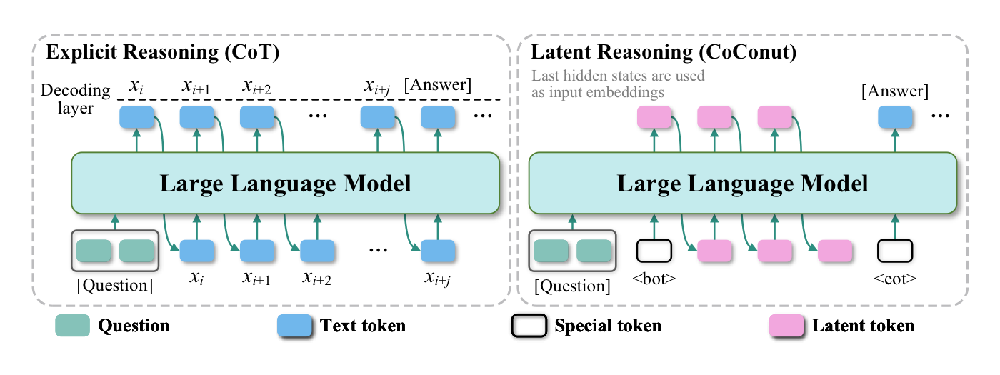
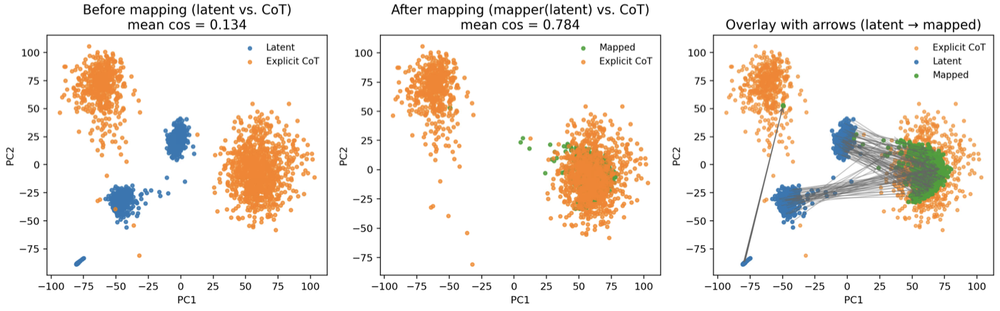
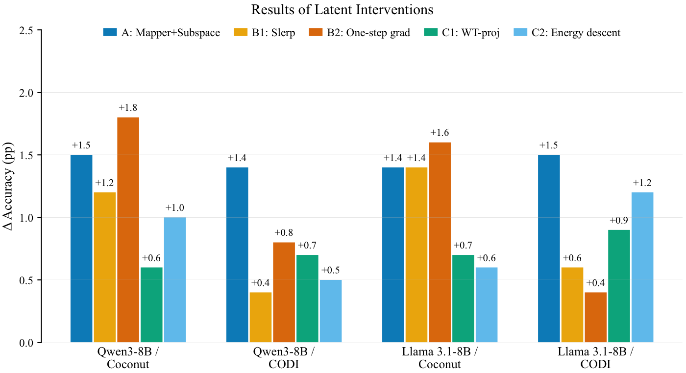

# Interpretable Latent Intervention

> Official repository for **"Unlocking the Black Box of Latent Reasoning: An Interpretability-Guided Approach to Intervention"**, accepted to **ACL 2026 Main**.

Official implementation of **Interpretable Latent Intervention**, an interpretability-guided framework for analyzing and intervening in latent reasoning trajectories of language models.

## 📋 Overview

Latent reasoning enables language models to perform multi-step inference through continuous hidden states rather than explicit Chain-of-Thought tokens. While this paradigm can reduce decoding cost, it also makes the reasoning process harder to inspect, understand, and control.

This project investigates how latent reasoning unfolds inside continuous representations. Instead of treating latent thoughts as opaque vectors, we analyze their geometric structure, semantic content, and causal role in reasoning. Based on these observations, we further design training-free decode-time interventions that steer latent reasoning trajectories without updating model parameters.

  

## 🔍 Method

We study latent reasoning from two complementary perspectives:

### Interpretation

We probe latent thought vectors through structural alignment, linear recoverability, lexical probing, and causal intervention analysis. Our findings suggest that latent vectors encode compressed semantic representations of intermediate reasoning steps, with early latent states playing a particularly important causal role in determining the final answer.

  

### Intervention

We convert the interpretability findings into training-free decode-time interventions. These interventions operate directly on latent reasoning states and steer the model's internal reasoning trajectory without modifying model parameters.

  

## ✨ Highlights

- Latent thought vectors exhibit strong geometric alignment with explicit reasoning states.
- Reasoning-step representations are linearly recoverable from latent vectors.
- Early latent states act as causal hubs for the final answer.
- Training-free decode-time interventions can improve reasoning accuracy without parameter updates.
- Experiments cover multiple model scales and reasoning domains, including mathematical and commonsense reasoning benchmarks.

## 🚀 Repository Status

- [x] Project page and README
- [x] Main figures and qualitative illustrations
- [ ] Paper release
- [ ] Inference code release

## 📄 Citation 

If you find this work useful in your research, please stay tuned for updates: The paper and inference code will be released soon.
